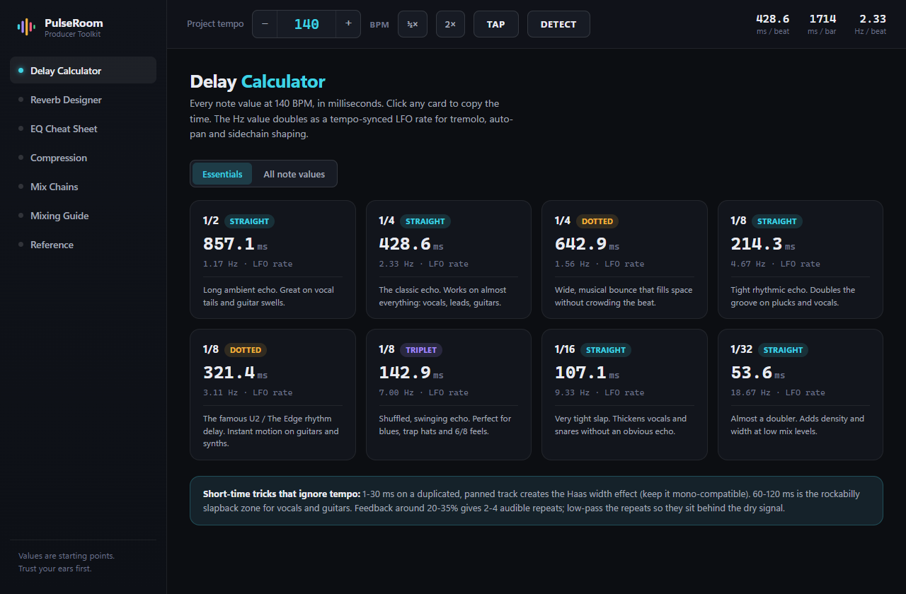
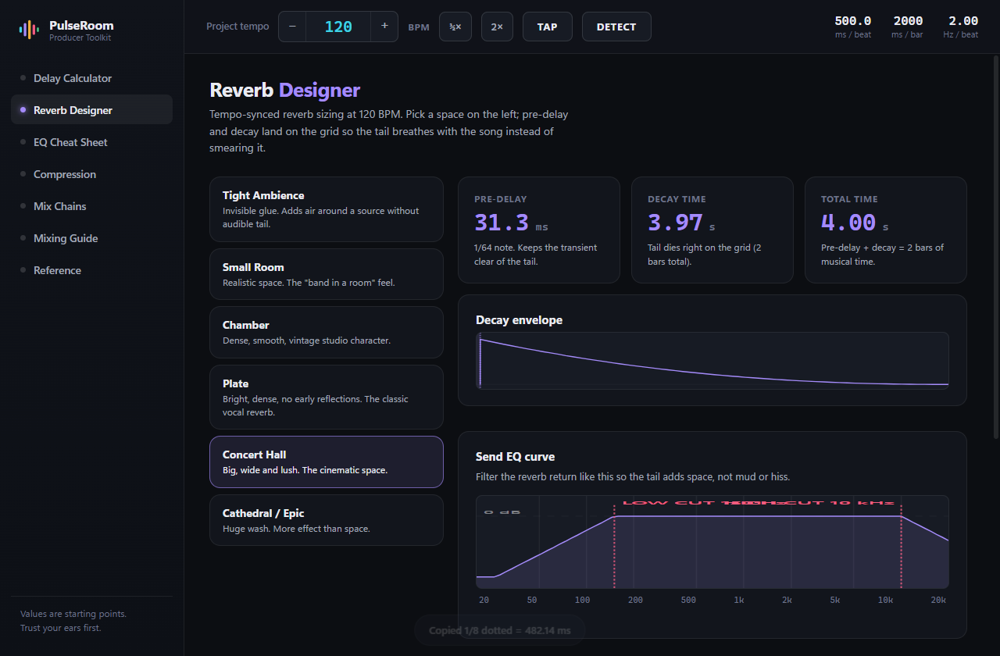
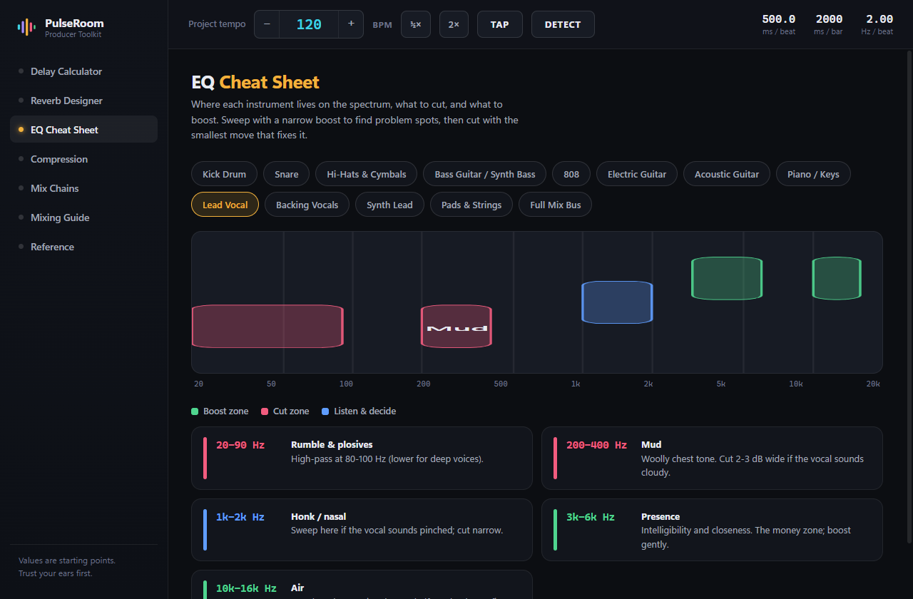
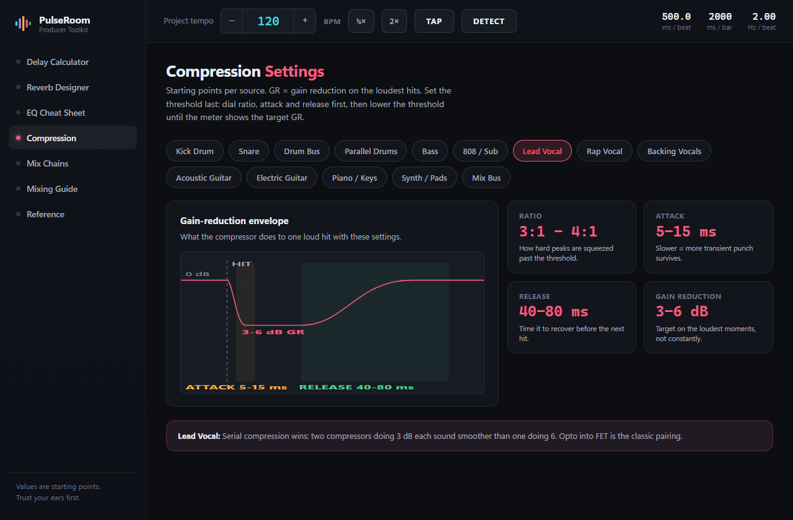
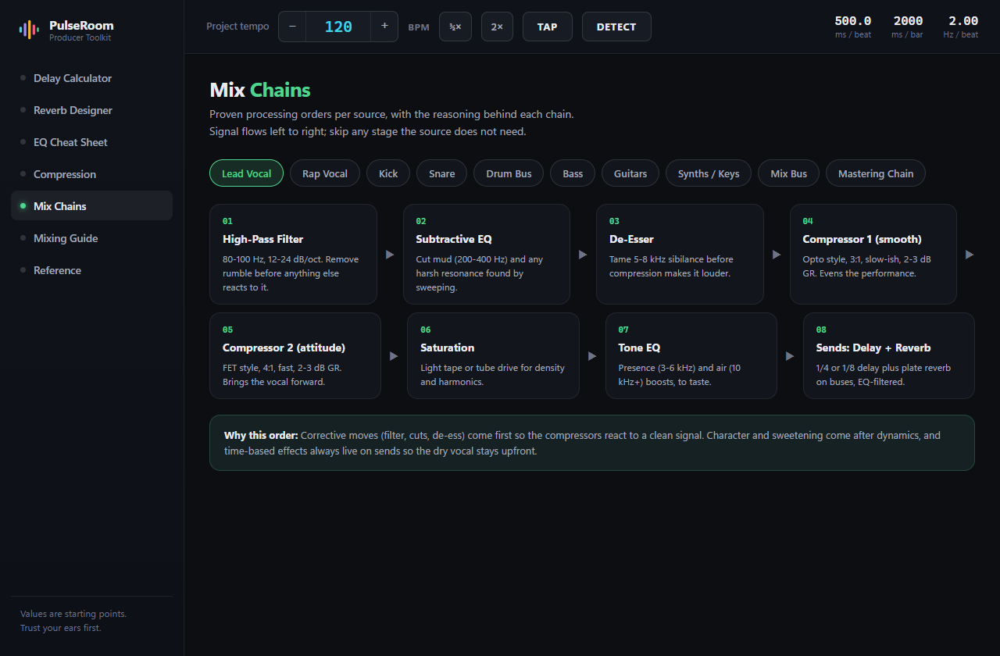

# PulseRoom

### Every mixing answer. One tempo.

A free desktop &amp; mobile toolkit for music producers. Drop in a song or tap your tempo, and PulseRoom turns it into delay times, reverb tails, EQ moves, and compression settings — visually, instantly, offline.

**Windows · macOS · Android**

### [⬇ Download the latest version](../../releases/latest)

---

## What it does

| | |
|---|---|
| **Tempo Detect** | Drop any song onto the window and PulseRoom finds its BPM in seconds — analysed entirely on your machine, no upload, no account. |
| **Delay Calculator** | The eight delay values producers actually use, synced to your BPM, one click to copy. The full 21-value grid is a toggle away. |
| **Reverb Designer** | Six spaces with pre-delay and decay locked to the bar grid — plus the send-EQ curve drawn for you. |
| **EQ Cheat Sheet** | Boost and cut zones for 13 instruments, painted onto a real spectrum. |
| **Compression** | The gain-reduction envelope for 14 sources. Attack and release stop being guesswork. |
| **Mix Chains** | Plugin order for vocals, drums, bass and the mastering chain — each step explained. |
| **Mixing Guide + Reference** | Gain staging to LUFS targets, frequency map, note-to-Hz for tuning 808s. |

---

### Delay Calculator
Every note value at your tempo, in milliseconds — with the LFO rate and a note on where each one shines.

### Reverb Designer
Pre-delay and decay that land on the bar grid, with the send-EQ curve you should copy.

### EQ Cheat Sheet
Where each instrument lives on the spectrum, and what to do there.

### Compression
Watch what the compressor actually does to a hit at these settings.

### Mix Chains
The right processing order — and the reasoning behind it.

---

## Download

Grab the latest installer from the [**Releases page**](../../releases/latest).

| Platform | File | Notes |
|---|---|---|
| **Windows** | `PulseRoom.Setup.*.exe` | Unsigned: if SmartScreen appears, click *More info → Run anyway*. |
| **macOS** | `PulseRoom-*-universal.dmg` | Universal (Intel + Apple Silicon). First launch: **right-click → Open**. |
| **Android** | `PulseRoom-*-Android.apk` | Allow installs from unknown sources when prompted. |
| **iOS** | `PulseRoom-*-iOS-unsigned.ipa` | Unsigned build. Apple only permits installs via the App Store / TestFlight, which requires an Apple Developer account. |

---

## Notes

- **Fully offline.** No account, no telemetry, no ads. Tempo detection runs locally in the app.
- **Values are starting points.** Trust your ears first — that's the app's own motto.
- The source code for PulseRoom is kept in a private repository. This repo hosts the public releases and showcase.

PulseRoom — the producer's reference desk. Made for the ones mixing at 2 a.m.

